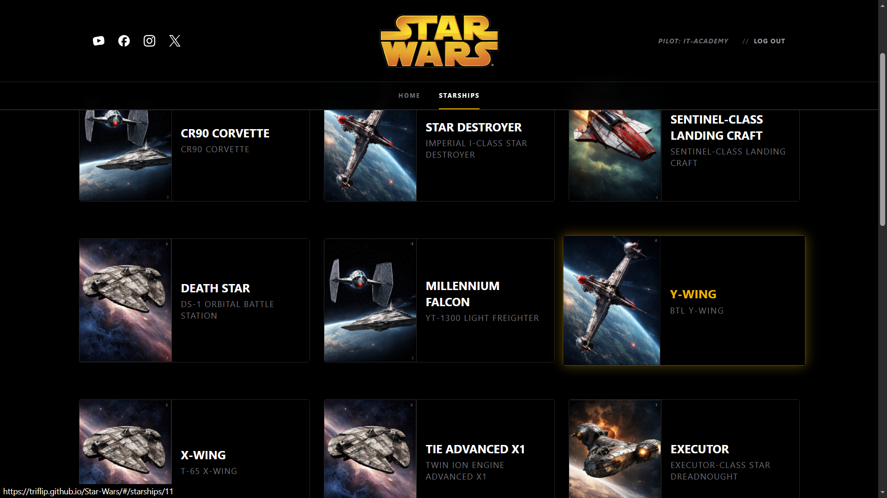

# 🌌 Star Wars Project

A React application that consumes the **Star Wars API (SWAPI)**, allowing users to explore starships, view their details, and manage access through an authentication system powered by Firebase.

<div align="center">
  
</div>

[](https://triflip.github.io/star-wars/)

---

## ✨ Features

- **Starship explorer** — Browse a collection of Star Wars starships.
- **Starship details** — View detailed information for each starship.
- **Authentication** — Login and logout using Firebase Authentication.
- **Protected routes** — Restrict access to authenticated sections.
- **Responsive design** — Optimized for desktop and mobile devices.
- **API integration** — Retrieve starship data from the Star Wars API (SWAPI).

## 🛠️ Technologies Used

- **React + Vite** — Frontend development and build tooling.
- **Redux Toolkit** — Global state management.
- **React Router DOM** — Navigation and protected routes.
- **Firebase** — Authentication and session persistence.
- **TailwindCSS** — Styling and responsive design.
- **Jest + React Testing Library** — Unit, component, and integration testing.

## 🧪 Testing

The project includes a testing architecture covering different parts of the application:

- **Unit tests** — Custom hook testing with `useAuthListener`.
- **Component tests** — Rendering and interaction testing with `StarshipCard`.
- **Integration tests** — Authentication flow and protected routes with `ProtectedRoute`.

Run the test suite with:

```bash
npm test
```

## 📦 Local Installation

1. Clone the repository:

   ```bash
   git clone https://github.com/triflip/star-wars.git
   cd star-wars
   ```

2. Install dependencies:

   ```bash
   npm install
   ```

3. Create a `.env` file with your Firebase configuration:

   ```env
   VITE_FIREBASE_API_KEY=your_api_key
   VITE_FIREBASE_AUTH_DOMAIN=your_auth_domain
   VITE_FIREBASE_PROJECT_ID=your_project_id
   VITE_FIREBASE_STORAGE_BUCKET=your_storage_bucket
   VITE_FIREBASE_MESSAGING_SENDER_ID=your_messaging_sender_id
   VITE_FIREBASE_APP_ID=your_app_id
   ```

4. Start the development server:

   ```bash
   npm run dev
   ```

## 📁 Project Structure

```text
star-wars/
├── public/
│   ├── logo/
│   ├── logo_mobile/
│   ├── social-icons/
│   └── background/
├── src/
│   ├── components/
│   ├── features/
│   ├── hooks/
│   ├── pages/
│   ├── router/
│   ├── firebase/
│   └── styles/
├── index.html
├── package.json
├── vite.config.js
├── jest.config.cjs
└── README.md
```

## 📤 Deployment

The application is deployed on **GitHub Pages**.

The project uses Vite's `BASE_URL` configuration to ensure that assets and routes work correctly under the `/star-wars/` path.

To build the project:

```bash
npm run build
```

To deploy to GitHub Pages:

```bash
npm run deploy
```

---

Built with React, Redux Toolkit, Firebase and TailwindCSS.
